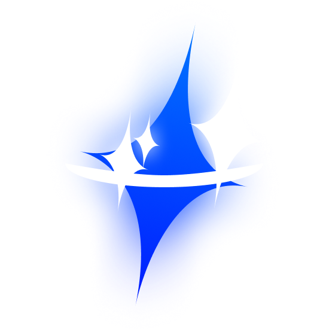

<h1>  Zen</h1>

 A Sol's RNG Macro to track Biomes, Merchants and Auras. I am building off of maxstellar's Biome Macro for Mac.

# How to install?
Go to **https://www.python.org/** and install the latest version of Python.
Then, open a console and navigate to the macro folder you just unzipped from the ZIP you downloaded.

Once there, type the following into your terminal:
`pip3 install -r requirements.txt`

If that doesn't work, try:
`pip install -r requirements.txt`

**If you want to enable Roll, Merchant and Eden detection (Patching Roblox):**
- Navigate to `/Applications/Roblox.app/Contents/MacOS/`
- Make a new directory called `ClientSettings`.
- In that directory, create a file called `ClientAppSettings.json`.
- In that file, paste in `{"FStringDebugLuaLogLevel": "debug", "FStringDebugLuaLogPattern": "ExpChat/mountClientApp"}` and save it.
- After that, restart the macro and Roblox if they are open.

Also, you should open `config.ini` and set **username_override** to **your roblox username**.
